# tolkien

**Academic Article Production Multi-Agent System** — a framework for producing complete, publication-ready scientific papers from first prompt to final PDF, powered by specialized AI agents and skills running inside Claude Code, OpenCode, and OpenAI Codex.


---

## License

This project is licensed under the **GNU General Public License v2.0 (GPL-2.0)**.

For full license text, see [LICENSE](LICENSE) file.

---

## Documentation in Other Languages

- [README em Português (Brazilian Portuguese)](README_pt-BR.md) — Documentação completa disponível em português.

---

## Features

- **10-phase sequential pipeline** with 6 mandatory quality gates (G1–G5.5) — from research question to compiled PDF
- **6 specialized agents**: orchestrator, research, writing, review, paper generator, and web search
- **21 atomic skills**: literature search (OpenAlex), LaTeX compilation, 5-D peer review, humanization, citation validation, and more
- **Cross-IDE compatibility** — identical configuration for Claude Code (`.claude/`) and OpenCode (`.agents/`)
- **Spec-Driven Development** adapted for science — every paper starts with a validated PRD and implementation plan

---

## Quick Start

```bash
# 1. Clone the repository
git clone https://gitlab.com/leandroimail/tolkien.git
cd tolkien

# 2. Install all dependencies (system, Node.js, Python)
bash resources/install_skills_deps.sh

# 3. Activate the Python virtual environment
source .venv/bin/activate

# 4. Start a new paper project (Claude Code)
/academic-orchestrator "Start a new research article about transformer architectures"
```

The orchestrator will guide you through a structured PRD interview and then execute the full pipeline automatically, pausing at each mandatory gate for your review.

---

## Documentation

| Document | Description |
|----------|-------------|
| [Architecture](docs/ARCHITECTURE.md) | System diagram, 3-layer model, 10-phase pipeline, gate criteria, data flow |
| [Definitions](docs/DEFINITIONS.md) | Glossary, agent inventory, skill catalog, directory specification |
| [Tutorial](docs/TUTORIAL.md) | Step-by-step guide: installation, Claude Code usage, OpenCode usage, end-to-end example, troubleshooting |
| [Quickstart](docs/QUICKSTART.md) | 5-minute crash course with copy-paste commands (EN + pt-BR) |
| [System PRD](docs/PRD-academic-multiagent-system.md) | Full technical specification for the tolkien system itself |

---

## Compatibility

tolkien stores its configuration in two parallel directories:

| Directory | AI Tool |
|-----------|---------|
| `.claude/` | [Claude Code](https://claude.ai/code) — Anthropic's CLI |
| `.agents/` | [OpenCode](https://opencode.ai) & [OpenAI Codex](https://openai.com/codex) |

Both directories contain identical agent and skill definitions. OpenAI Codex shares the same `.agents/` directory as OpenCode. You can use tolkien with any of these tools without any changes to your paper project files.

---

## Project Structure

All paper projects must be created under one of the valid root directories:

```text
projects/   papers/   .projects/   .papers/
```

Each project follows a standard layout:

```text
papers/paper-{slug}/
├── prd.md                 # Paper requirements
├── plan.md                # Execution roadmap
├── research/              # Literature + references.bib
├── draft/                 # Section markdown files
├── review/                # Review reports + revision logs
├── output/                # Final deliverables (PDF, LaTeX, DOCX)
└── process-record.md      # Human-AI collaboration log
```

---

## Pipeline Overview

```mermaid
flowchart LR
    p0["Phase 0\nPRD Generation"] -->|G1| p1["Phase 1\nImplementation Plan"]
    p1 -->|G2| p2["Phase 2\nLiterature Research"]
    p2 --> p3["Phase 3\nOutline"]
    p3 -->|G3| p4["Phase 4\nFull-text Drafting"]
    p4 --> p5["Phase 5\nCitation Validation"]
    p5 -->|G4| p6["Phase 6\nHumanization"]
    p6 --> p7["Phase 7\nPeer Review"]
    p7 -->|G5| p8["Phase 8\nOutput Generation"]
    p8 -->|G5.5| p9["Phase 9\nProcess Documentation"]
```



See [docs/ARCHITECTURE.md](docs/ARCHITECTURE.md) for the complete pipeline diagram with gate criteria.

---

## Prerequisites

- macOS or Linux
- Python 3.8+
- Node.js 16+
- [Claude Code CLI](https://claude.ai/code), [OpenCode](https://opencode.ai), or [OpenAI Codex](https://openai.com/codex)
- Homebrew (macOS) or apt-get (Linux) for system dependencies

Run `bash resources/install_skills_deps.sh` to install all remaining dependencies automatically.
