# tolkien

**Sistema Multi-Agente de Produção de Artigos Acadêmicos** — um framework para produzir artigos científicos completos e prontos para publicação, desde o primeiro prompt até o PDF final, utilizando agentes e skills especializados dentro do Claude Code, OpenCode e OpenAI Codex.


---

## Licença

Este projeto está licenciado sob a **GNU General Public License v2.0 (GPL-2.0)**.

Para o texto completo da licença, consulte o arquivo [LICENSE](LICENSE).

---

## Funcionalidades

- **Pipeline sequencial de 10 fases** com 6 gates obrigatórios de qualidade (G1–G5.5) — desde a pergunta de pesquisa até o PDF compilado
- **6 agentes especializados**: orquestrador, pesquisa, escrita, revisão, gerador de artigo e busca web
- **21 skills atômicas**: busca bibliográfica (OpenAlex), compilação LaTeX, revisão por pares em 5 dimensões, humanização, validação de citações e mais
- **Compatibilidade multi-IDE** — configuração idêntica para Claude Code (`.claude/`) e OpenCode (`.agents/`)
- **Desenvolvimento guiado por especificação (Academic SDD)** — todo artigo começa com um PRD validado e um plano de implementação

---

## Início Rápido

```bash
# 1. Clone o repositório
git clone https://gitlab.com/leandroimail/tolkien.git
cd tolkien

# 2. Instale todas as dependências (sistema, Node.js, Python)
bash resources/install_skills_deps.sh

# 3. Ative o ambiente virtual Python
source .venv/bin/activate

# 4. Inicie um novo projeto de artigo (Claude Code)
/academic-orchestrator "Iniciar um novo artigo sobre arquiteturas transformer"
```

O orquestrador vai guiá-lo por uma entrevista estruturada de PRD e, em seguida, executar o pipeline completo automaticamente, pausando em cada checkpoint obrigatório para sua revisão.

---

## Documentação

| Documento | Descrição |
|-----------|-----------|
| [Arquitetura](docs/ARCHITECTURE.md) | Diagrama do sistema, modelo em 3 camadas, pipeline de 10 fases, critérios dos gates, fluxo de dados |
| [Definições](docs/DEFINITIONS.md) | Glossário, inventário de agentes, catálogo de skills, especificação de diretórios |
| [Tutorial](docs/TUTORIAL_pt-BR.md) | Guia passo a passo: instalação, uso com Claude Code, uso com OpenCode, exemplo completo, solução de problemas |
| [Início Rápido](docs/QUICKSTART.md) | Crash course de 5 minutos com comandos prontos para copiar (EN + pt-BR) |
| [PRD do Sistema](docs/PRD-academic-multiagent-system_pt-BR.md) | Especificação técnica completa do próprio sistema tolkien |

---

## Compatibilidade

O tolkien armazena sua configuração em dois diretórios paralelos:

| Diretório | Ferramenta |
|-----------|------------|
| `.claude/` | [Claude Code](https://claude.ai/code) — CLI da Anthropic |
| `.agents/` | [OpenCode](https://opencode.ai) & [OpenAI Codex](https://openai.com/codex) |

Ambos os diretórios contêm definições de agentes e skills idênticas. O OpenAI Codex usa o mesmo diretório `.agents/` que o OpenCode. Você pode usar o tolkien com qualquer uma das ferramentas sem precisar modificar os arquivos do seu projeto de artigo.

---

## Estrutura de Projetos

### Diretório do Sistema

```
tolkien/
├── .agents/                    ← Configuração do OpenCode & OpenAI Codex
├── .claude/                    ← Configuração do Claude Code
├── resources/                  ← Scripts de instalação e dependências
│   ├── install_skills_deps.sh  ← Script principal de instalação
│   └── requirements_skills.txt ← Lista de pacotes Python
├── templates/                  ← Templates prontos para uso
│   ├── research_request_form.md ← Formulário para entrevista do PRD
│   └── systematic_review_protocol.yaml ← Protocolo PRISMA
├── .venv/                      ← Ambiente virtual Python
├── docs/                       ← Documentação do sistema
├── papers/                     ← Projetos de artigos
├── projects/                   ← Diretório raiz alternativo
└── AGENTS.md                   ← Este arquivo
```

### Estrutura de Projetos de Artigos

Todos os projetos de artigos devem ser criados em um dos diretórios raiz válidos:

```text
projects/   papers/   .projects/   .papers/
```

Cada projeto segue uma estrutura padrão:

```text
papers/paper-{slug}/
├── prd.md                 # Requisitos do artigo
├── plan.md                # Roteiro de execução
├── research/              # Literatura + references.bib
├── draft/                 # Seções do artigo em Markdown
├── review/                # Relatórios de revisão + histórico de revisões
├── output/                # Entregáveis finais (PDF, LaTeX, DOCX)
└── process-record.md      # Histórico de colaboração humano-IA
```

---

## Visão Geral do Pipeline

```mermaid
flowchart LR
    p0["Fase 0\nGeração do PRD"] -->|G1| p1["Fase 1\nPlano de Implementação"]
    p1 -->|G2| p2["Fase 2\nPesquisa Bibliográfica"]
    p2 --> p3["Fase 3\nEstrutura (Outline)"]
    p3 -->|G3| p4["Fase 4\nRedação Completa"]
    p4 --> p5["Fase 5\nValidação de Citações"]
    p5 -->|G4| p6["Fase 6\nHumanização"]
    p6 --> p7["Fase 7\nRevisão por Pares"]
    p7 -->|G5| p8["Fase 8\nGeração do Output"]
    p8 -->|G5.5| p9["Fase 9\nDocumentação do Processo"]
```



Consulte [docs/ARCHITECTURE.md](docs/ARCHITECTURE.md) para o diagrama completo do pipeline com critérios dos gates.

---

## Pré-requisitos

- macOS ou Linux
- Python 3.8+
- Node.js 16+
- [Claude Code CLI](https://claude.ai/code), [OpenCode](https://opencode.ai) ou [OpenAI Codex](https://openai.com/codex)
- Homebrew (macOS) ou apt-get (Linux) para dependências do sistema

Execute `bash resources/install_skills_deps.sh` para instalar todas as dependências restantes automaticamente.
