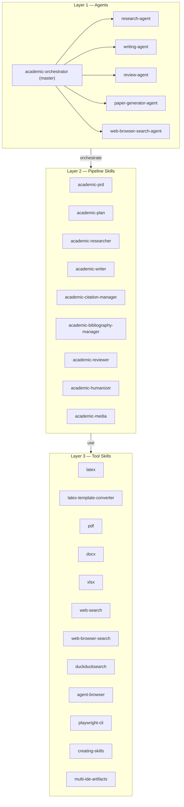
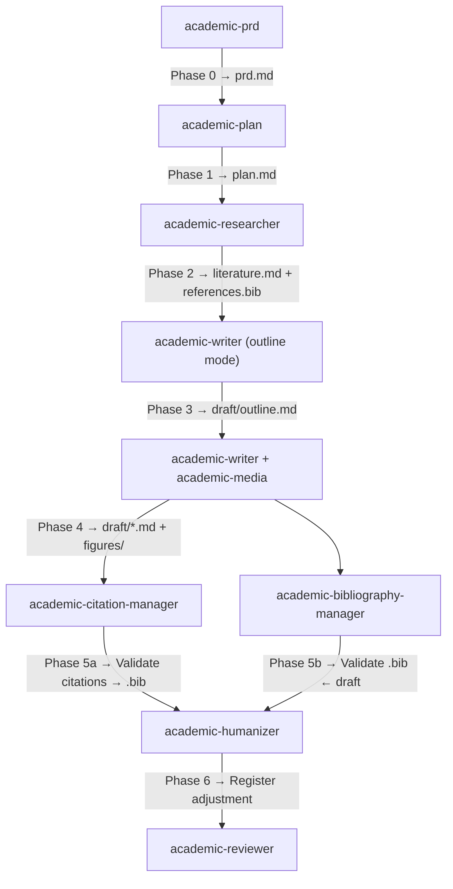

# Tolkien — System Architecture

---

## System Overview

tolkien is a three-layer multi-agent system. Agents at the top layer coordinate skills in the middle layer. Tool skills at the bottom layer handle external systems and document formats.



---

## Agent Responsibility Matrix

| Agent | Phase(s) | Core Responsibility | Dispatches | Triggers |
|-------|---------|---------------------|------------|---------|
| `academic-orchestrator` | All (0–9) | Pipeline coordinator; enforces gates; maintains project state | All agents | `/academic-orchestrator`, `"start academic pipeline"`, `"write full article"`, `"academic pipeline"`, `/status` |
| `research-agent` | 2 | Literature search, triage, and bibliography synthesis | `academic-researcher`, `academic-bibliography-manager`, `web-browser-search-agent` | `/research-agent`, `"research for paper"`, `"search literature and validate bib"` |
| `writing-agent` | 3–4, 6 | Section drafting, figure generation, humanization | `academic-writer`, `academic-media`, `academic-humanizer` | `/writing-agent`, `"draft full article"`, `"write and humanize"` |
| `review-agent` | 5, 7 | Citation↔Bibliography gate + 5-D peer review | `academic-citation-manager`, `academic-bibliography-manager`, `academic-reviewer`, `web-browser-search-agent` | `/review-agent`, `"review full article"`, `"execute academic review"` |
| `paper-generator-agent` | 8 | LaTeX compilation and final document export | `latex`, `latex-template-converter`, `pdf`, `docx` | `/paper-generator`, `"generate final paper"`, `"compile LaTeX"` |
| `web-browser-search-agent` | 2, 7 | Web search for grey literature, full-text retrieval, retraction checks | `web-browser-search`, `duckducksearch`, `agent-browser`, `playwright-cli` | `/web-browser-search-agent` (internal); also `"search the web"`, `"browse URL"`, `"validate DOI online"`, `"check URL"`, `"open website"`, `"extract web content"` |

---

## Skill Taxonomy

### Pipeline Skills (9)

These skills implement the academic writing workflow in sequence.



### Tool Skills (12)

These skills are stateless utilities usable at any phase.

| Category | Skills |
|----------|--------|
| Document output | `latex`, `latex-template-converter`, `pdf`, `docx`, `xlsx` |
| Web / search | `web-search`, `web-browser-search`, `duckducksearch` |
| Browser automation | `agent-browser`, `playwright-cli` |
| Meta / tooling | `creating-skills`, `multi-ide-artifacts` |

---

## 10-Phase Pipeline with Gates

The pipeline is strictly sequential. A gate failure halts the pipeline until the criteria are met.

```mermaid
flowchart TD
    subgraph MAP["THE MAP"]
        p0["Phase 0\nacademic-prd\n→ prd.md"]
        g1{"G1 Gate\nprd.md has all\n10 mandatory fields?"}
        p1["Phase 1\nacademic-plan\n→ plan.md"]
        g2{"G2 Gate\nplan.md covers all\n9+ phases?"}
        p0 --> g1
        g1 -->|Pass| p1
        g1 -->|"Fail: fix prd.md"| p0
        p1 --> g2
    end
    subgraph FOUND["THE FOUNDATION"]
        p2["Phase 2\nresearch-agent\n→ literature.md + references.bib"]
        p3["Phase 3\nwriting-agent\n→ draft/outline.md"]
        g3{"G3 Gate\nOutline approved?\n(structure + word budget)"}
        p2 --> p3 --> g3
    end
    subgraph DRAFT["THE DRAFT"]
        p4["Phase 4\nwriting-agent\n→ draft/*.md + output/figures/"]
        p5["Phase 5\nreview-agent\n→ citation-report.md\n+ bibliography-report.md"]
        g4{"G4 Gate\nViolations = 0?\nRule 1: all citations in .bib\nRule 2: all .bib entries cited\nRule 3: all .bib fields present"}
        p4 --> p5 --> g4
    end
    subgraph QUALITY["THE QUALITY"]
        p6["Phase 6\nwriting-agent\n→ draft/*.md (humanized)"]
        p7["Phase 7\nreview-agent\n→ review-report.md"]
        g5{"G5 Gate\nScore ≥ 65 AND\nno CRITICAL issues?"}
        p6 --> p7 --> g5
    end
    subgraph OUTPUT["THE FINALIZED OUTPUT"]
        p8["Phase 8\npaper-generator-agent\n→ paper.tex + paper.pdf + paper.docx"]
        g55{"G5.5 Gate\npdflatex exits 0?\nAll refs resolved?"}
        p9["Phase 9\nacademic-orchestrator\n→ process-record.md"]
        p8 --> g55
    end

    g2 -->|Pass| p2
    g2 -->|"Fail: fix plan.md"| p1
    g3 -->|Pass| p4
    g3 -->|"Fail: revise outline"| p3
    g4 -->|Pass| p6
    g4 -->|"Fail: fix violations"| p5
    g5 -->|Pass| p8
    g5 -->|"Fail: revise draft"| p6
    g55 -->|Pass| p9
    g55 -->|"Fail: fix LaTeX"| p8
```



### Gate Criteria Summary

| Gate | After Phase | Blocking Criterion |
|------|------------|-------------------|
| G1 | Phase 0 | `prd.md` contains all 10 mandatory fields (title, type, field, language, RQs, venue, style, structure, scope, constraints) |
| G2 | Phase 1 | `plan.md` represents all 9+ pipeline phases with deliverables and acceptance criteria |
| G3 | Phase 3 | Outline (`draft/outline.md`) approved: section structure, word allocation per section |
| G4 | Phase 5 | Citation↔Bibliography validation passes with 0 violations (Rules 1, 2, and 3) |
| G5 | Phase 7 | Peer review composite score ≥ 65/100 AND no dimension rated CRITICAL |
| G5.5 | Phase 8 | LaTeX compilation exits with code 0; no undefined references; PDF renders correctly |

---

## Data Flow Between Phases

| Phase | Agent/Skill | Input Artifacts | Output Artifacts |
|-------|------------|----------------|-----------------|
| 0 | `academic-prd` | User input (form or interview) | `prd.md` |
| 1 | `academic-plan` | `prd.md` | `plan.md` |
| 2 | `research-agent` → `academic-researcher`, `academic-bibliography-manager` | `prd.md` (keywords, RQs, scope) | `research/literature.md`, `research/search-strategy.md`, `research/references.bib` |
| 3 | `writing-agent` → `academic-writer` (outline mode) | `prd.md`, `research/literature.md` | `draft/outline.md` |
| 4 | `writing-agent` → `academic-writer`, `academic-media` | `draft/outline.md`, `research/references.bib` | `draft/abstract.md`, `draft/introduction.md`, `draft/methodology.md`, `draft/results.md`, `draft/discussion.md`, `draft/conclusion.md`, `output/figures/` |
| 5 | `review-agent` → `academic-citation-manager`, `academic-bibliography-manager` | All `draft/*.md`, `research/references.bib` | `review/citation-report.md`, `review/bibliography-report.md` |
| 6 | `writing-agent` → `academic-humanizer` | All `draft/*.md` | `draft/*.md` (humanized in place) |
| 7 | `review-agent` → `academic-reviewer` | All `draft/*.md`, `review/citation-report.md` | `review/review-report.md`, `review/revision-log.md` |
| 8 | `paper-generator-agent` → `latex`, `latex-template-converter`, `pdf`, `docx` | All `draft/*.md`, `research/references.bib`, `output/figures/` | `output/paper.tex`, `output/paper.pdf`, `output/paper.docx` |
| 9 | `academic-orchestrator` | Full project state | `process-record.md` |

---

## Cross-IDE Configuration

tolkien maintains two parallel configuration directories for compatibility with different AI coding tools:

```
tolkien/
├── .claude/          ← Claude Code (CLI) configuration
│   ├── agents/       ← 6 agent definition files (.md)
│   ├── skills/       ← 21 skill modules (each in its own subdirectory)
│   └── settings.local.json  ← Harness permissions
│
└── .agents/          ← OpenCode configuration (mirror)
    ├── agents/       ← same 6 agent definitions
    └── skills/       ← same 21 skill modules
```

Both trees contain identical content. The `multi-ide-artifacts` skill handles synchronization when definitions are updated.
