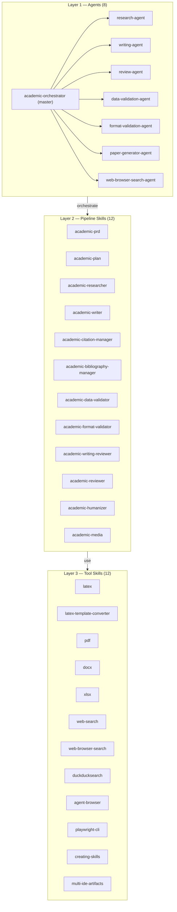

# Tolkien — System Architecture

> **Language / Idioma:** English | [Versão em Português](pt-BR/ARCHITECTURE.md)

---

## System Overview

tolkien is a three-layer multi-agent system. Agents at the top layer coordinate skills in the middle layer. Tool skills at the bottom layer handle external systems and document formats.


```mermaid
graph TD
    subgraph L1["Layer 1 — Agents (8)"]
        orch["academic-orchestrator (master)"]
        ra[research-agent]
        wa[writing-agent]
        rev[review-agent]
        dva[data-validation-agent]
        fva[format-validation-agent]
        pg[paper-generator-agent]
        wbs[web-browser-search-agent]
        orch --> ra & wa & rev & dva & fva & pg & wbs
    end
    subgraph L2["Layer 2 — Pipeline Skills (12)"]
        ps1[academic-prd]
        ps2[academic-plan]
        ps3[academic-researcher]
        ps4[academic-writer]
        ps5[academic-citation-manager]
        ps6[academic-bibliography-manager]
        ps7[academic-data-validator]
        ps8[academic-format-validator]
        ps9[academic-writing-reviewer]
        ps10[academic-reviewer]
        ps11[academic-humanizer]
        ps12[academic-media]
    end
    subgraph L3["Layer 3 — Tool Skills (12)"]
        ts1[latex]
        ts2[latex-template-converter]
        ts3[pdf]
        ts4[docx]
        ts5[xlsx]
        ts6[web-search]
        ts7[web-browser-search]
        ts8[duckducksearch]
        ts9[agent-browser]
        ts10[playwright-cli]
        ts11[creating-skills]
        ts12[multi-ide-artifacts]
    end
    L1 -->|orchestrate| L2
    L2 -->|use| L3
```

---

## Agent Responsibility Matrix

| Agent | Phase(s) | Core Responsibility | Dispatches | Triggers |
|-------|---------|---------------------|------------|---------|
| `academic-orchestrator` | All (0–9) | Master coordinator; executes the full 10-phase pipeline, manages gates and the Continuous Revision Loop | All agents & skills | `/academic-orchestrator`, `"start academic pipeline"`, `"write full article"`, `"academic pipeline"`, `/status` |
| `research-agent` | 2 | Literature search, triage, and bibliography synthesis | `academic-researcher`, `academic-bibliography-manager`, `web-browser-search-agent` | `/research-agent`, `"research for paper"`, `"search literature and validate bib"` |
| `writing-agent` | 3–4, 6 | Section drafting (Scope Cards & CEI), figures/EDA, two-pass humanization, and writing audit | `academic-writer`, `academic-media`, `academic-humanizer`, `academic-writing-reviewer` | `/writing-agent`, `"draft full article"`, `"write and humanize"`, `"write section"` |
| `review-agent` | 5, 5.5, 7 | Citation↔Bibliography gate (G4), Data Integrity gate (G4.5), writing audit feeding Dim 5, and 6-D peer review | `academic-citation-manager`, `academic-bibliography-manager`, `academic-data-validator`, `academic-writing-reviewer`, `academic-reviewer`, `web-browser-search-agent` | `/review-agent`, `"review full article"`, `"execute academic review"`, `"verify citations"` |
| `data-validation-agent` | 5.5, 8 | Data Integrity gate (G4.5): text↔table/figure congruence, numeric consistency, float integrity | `academic-data-validator`, `academic-media` | `/data-validation-agent`, `"validate data congruence"`, `"check data integrity"` |
| `format-validation-agent` | 8 | Output Format Gate: always-on md/tex/docx formatting validation | `academic-format-validator`, `latex`, `docx` | `/format-validation-agent`, `"validate formatting"`, `"validate docx"`, `"check format"` |
| `paper-generator-agent` | 8 | LaTeX/Word compilation and final document export | `latex`, `latex-template-converter`, `pdf`, `docx`, `academic-format-validator` | `/paper-generator`, `"generate final paper"`, `"compile LaTeX"`, `"export paper"` |
| `web-browser-search-agent` | 2, 7 | Web search for grey literature, full-text retrieval, retraction checks | `web-browser-search`, `duckducksearch`, `agent-browser`, `playwright-cli` | `/web-browser-search-agent` (internal); also `"search the web"`, `"browse URL"`, `"validate DOI online"`, `"check URL"`, `"open website"`, `"extract web content"` |

---

## Skill Taxonomy

### Pipeline Skills (12)

These skills implement the academic writing workflow in sequence.

```mermaid
flowchart TD
    prd[academic-prd] -->|"Phase 0 → prd.md"| plan[academic-plan]
    plan -->|"Phase 1 → plan.md"| researcher[academic-researcher]
    researcher -->|"Phase 2 → literature.md + references.bib"| writer_ol["academic-writer (outline mode)"]
    writer_ol -->|"Phase 3 → draft/outline.md"| writer_full["academic-writer + academic-media\n(Scope Cards & CEI Architecture)"]
    writer_full -->|"Phase 4 → draft/*.md + figures/"| citmgr[academic-citation-manager]
    writer_full --> bibmgr[academic-bibliography-manager]
    citmgr & bibmgr -->|"Phase 5 → Gate G4 (Citation↔Bib)"| dataval[academic-data-validator]
    dataval -->|"Phase 5.5 → Gate G4.5 (Data Integrity)"| humanizer[academic-humanizer\n(Local & Global Passes)]
    humanizer -->|"Phase 6 → Naturalized draft/*.md"| writrev[academic-writing-reviewer\n(AIM, REP, NUM, JAR Audit)]
    writrev -->|"Phase 6.5 → writing-review-report.md"| reviewer["academic-reviewer (Phase 7: 6-D Review)\n*Dimension 5 consumes writing audit*"]
    reviewer -->|"Phase 8 → Output Format Gate"| fmtval[academic-format-validator]
```

### Tool Skills (12)

These skills are stateless utilities usable at any phase.

| Category | Skills |
|----------|--------|
| Document output | `latex`, `latex-template-converter`, `pdf`, `docx`, `xlsx` |
| Web / search | `web-search`, `web-browser-search`, `duckducksearch` |
| Browser automation | `agent-browser`, `playwright-cli` |
| Meta / tooling | `creating-skills`, `multi-ide-artifacts` |

---

## 10-Phase Pipeline with Gates & Continuous Revision Loop

The pipeline is strictly sequential with mandatory quality checkpoints (Gates) and an automatic **Continuous Revision Loop** for Phases 5–7.


```mermaid
flowchart TD
    subgraph MAP["THE MAP"]
        p0["Phase 0\nacademic-prd\n→ prd.md"]
        g1{"G1 Gate\nprd.md has all\n10 mandatory fields?"}
        p1["Phase 1\nacademic-plan\n→ plan.md"]
        g2{"G2 Gate\nplan.md covers all\n9+ phases?"}
        p0 --> g1
        g1 -->|Pass| p1
        g1 -->|"Fail: fix prd.md"| p0
        p1 --> g2
    end
    subgraph FOUND["THE FOUNDATION"]
        p2["Phase 2\nresearch-agent\n→ literature.md + references.bib"]
        p3["Phase 3\nwriting-agent\n→ draft/outline.md"]
        g3{"G3 Gate\nOutline approved?\n(structure + word budget)"}
        p2 --> p3 --> g3
    end
    subgraph DRAFT["THE DRAFT & INTEGRITY"]
        p4["Phase 4\nwriting-agent\n→ draft/*.md (Scope Cards + CEI) + figures/"]
        p5["Phase 5\nreview-agent\n→ citation-report.md + bibliography-report.md"]
        g4{"G4 Gate\nCitation↔Bib\n0 violations"}
        p55["Phase 5.5\ndata-validation-agent\n→ data-congruence-report.md"]
        g45{"G4.5 Gate\nData Integrity\n0 blocking data findings"}
        p4 --> p5 --> g4
        g4 -->|Pass| p55 --> g45
    end
    subgraph QUALITY["THE QUALITY & REVISION LOOP"]
        p6["Phase 6\nwriting-agent\n→ draft/*.md (humanized) +\nwriting-review-report.md"]
        p7["Phase 7\nreview-agent\n→ review-report.md (6-D Review)"]
        g5{"G5 Gate\nScore ≥ 65 AND\n0 CRITICAL Devil's Advocate\nP1 items addressed?"}
        p6 --> p7 --> g5
    end
    subgraph OUTPUT["THE FINALIZED OUTPUT"]
        p8["Phase 8\npaper-generator-agent\n→ paper.tex / paper.pdf / paper.docx"]
        gfmt{"Output Format Gate\nmd/tex/docx validated?\nCompilation error-free?"}
        p9["Phase 9\nacademic-orchestrator\n→ process-record.md"]
        p8 --> gfmt
        gfmt -->|Pass| p9
    end

    g2 -->|Pass| p2
    g2 -->|"Fail: fix plan.md"| p1
    g3 -->|Pass| p4
    g3 -->|"Fail: revise outline"| p3
    g4 -->|"Fail: fix citations/.bib"| p4
    g45 -->|Pass| p6
    g45 -->|"Fail: reconcile data/floats"| p4
    g5 -->|Pass: Complete Approval| p8
    g5 -->|"Fail: Revision Loop (rewrite & re-review)"| p4
    gfmt -->|"Fail: fix formats/templates"| p8
```

### Continuous Revision Loop
After an article is drafted, validation and review **always run and always feed back into rewriting**. Phases 5–7 form an automated feedback loop:
$$\text{write} \longrightarrow \text{validate (G4, G4.5)} \longrightarrow \text{6-D review (G5)} \longrightarrow \text{rewrite/correct} \longrightarrow \text{re-review}$$

The orchestrator advances to final output only when **Complete Approval** is reached:
- G4 PASS (0 orphan/phantom citations, bib complete)
- G4.5 PASS (0 blocking data/float/arithmetic findings)
- Output Format Gate PASS
- Review verdict = Accept (0 unresolved Devil's Advocate CRITICAL, all Priority-1 Roadmap items FULLY_ADDRESSED).

If approval is not reached after 3 loops, the orchestrator pauses at a human checkpoint.

### Gate Criteria Summary

| Gate | After Phase | Blocking Criterion |
|------|------------|-------------------|
| **G1** | Phase 0 | `prd.md` contains all 10 mandatory fields (title, type, field, language, RQs, venue, style, structure, scope, constraints) |
| **G2** | Phase 1 | `plan.md` represents all 9+ pipeline phases with deliverables and acceptance criteria |
| **G3** | Phase 3 | Outline (`draft/outline.md`) approved: section structure, word allocation per section, and scope cards |
| **G4** | Phase 5 | Citation↔Bibliography validation passes with 0 violations (Rules 1, 2, and 3) |
| **G4.5** | Phase 5.5 | Data Integrity Gate: 0 blocking data findings (float two-way integrity, table arithmetic, text↔table/figure direction); reconciliation warnings acknowledged |
| **G5** | Phase 7 | 6-D Peer Review composite score ≥ 65/100, 0 unresolved CRITICAL from Devil's Advocate, all Priority-1 Roadmap items FULLY_ADDRESSED |
| **Output Format Gate** | Phase 8 | Markdown, LaTeX and Word (.docx) validated cleanly; error-free compilation; no broken tags or unresolved references |

---

## Data Flow Between Phases

| Phase | Agent/Skill | Input Artifacts | Output Artifacts |
|-------|------------|----------------|-----------------|
| 0 | `academic-prd` | User input (form or interview) | `prd.md` |
| 1 | `academic-plan` | `prd.md` | `plan.md` |
| 2 | `research-agent` → `academic-researcher`, `academic-bibliography-manager` | `prd.md` (keywords, RQs, scope) | `research/literature.md`, `research/search-strategy.md`, `research/references.bib` |
| 3 | `writing-agent` → `academic-writer` (outline mode) | `prd.md`, `research/literature.md` | `draft/outline.md` |
| 4 | `writing-agent` → `academic-writer`, `academic-media` | `draft/outline.md`, `research/references.bib`, `resources/` (style guides) | `draft/*.md` (with Scope Cards and CEI structure), `output/figures/` |
| 5 | `review-agent` → `academic-citation-manager`, `academic-bibliography-manager` | All `draft/*.md`, `research/references.bib` | `review/citation-report.md`, `review/bibliography-report.md` |
| 5.5 | `data-validation-agent` → `academic-data-validator` | All `draft/*.md`, `research/references.bib`, `output/figures/` | `review/data-congruence-report.md` |
| 6 | `writing-agent` → `academic-humanizer`, `academic-writing-reviewer` | All `draft/*.md`, `resources/` | `draft/*.md` (humanized), `review/writing-review-report.md` |
| 7 | `review-agent` → `academic-reviewer` | All `draft/*.md`, `review/writing-review-report.md`, `review/citation-report.md`, `review/data-congruence-report.md` | `review/review-report.md`, `review/revision-log.md` |
| 8 | `paper-generator-agent` → `latex`, `latex-template-converter`, `pdf`, `docx`, `academic-format-validator` | All `draft/*.md`, `research/references.bib`, `output/figures/` | `output/paper.tex`, `output/paper.pdf`, `output/paper.docx`, `review/format-validation-report.md` |
| 9 | `academic-orchestrator` | Full project state | `process-record.md` |

---

## Multi-IDE Architecture

tolkien maintains a canonical-first architecture natively consumable across multiple AI coding platforms:

```
tolkien/
├── .agents/                    ← Canonical configuration (Codex, OpenCode, Antigravity)
│   ├── agents/                 ← 8 Canonical agent descriptors (.md)
│   └── skills/                 ← 24 Atomic Agent Skills (SKILL.md, scripts, references)
├── .claude/                    ← Claude Code configuration mirror
│   ├── agents/                 ← 8 Claude subagents (.md)
│   ├── skills/                 ← 24 Claude skills (.claude/skills/*/SKILL.md)
│   └── settings.json           ← Claude Code lifecycle hooks
├── .codex/                     ← OpenAI Codex configuration
│   ├── agents/                 ← 8 Codex subagent descriptors (.toml)
│   └── hooks.json              ← Codex lifecycle hooks
├── .opencode/                  ← OpenCode configuration
│   ├── agents/                 ← 8 OpenCode subagent descriptors (.md)
│   └── plugins/                ← OpenCode validation plugins (.js)
├── AGENTS.md                   ← Canonical rules & system documentation
└── CLAUDE.md                   ← Claude Code entry point & instructions
```

Synchronization between `.agents/` and `.claude/` is managed to guarantee 100% parity across skills, scripts, and agents.
