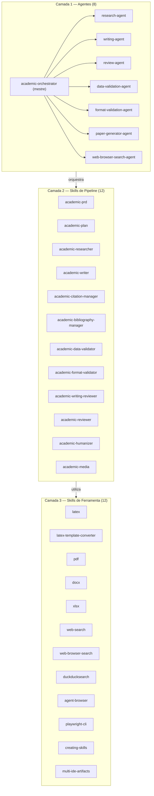

# Tolkien — Arquitetura do Sistema

> **Idioma / Language:** Português | [English Version](../ARCHITECTURE.md)

---

## Visão Geral do Sistema

O tolkien é um sistema multi-agente estruturado em três camadas funcionais. Os agentes na camada superior coordenam as skills na camada intermediária. As skills de ferramenta na camada inferior gerenciam formatos de documentos e integração com sistemas externos.



---

## Matriz de Responsabilidade dos Agentes

| Agente | Fase(s) | Responsabilidade Central | Skills Acionadas | Triggers Principais |
|-------|---------|-------------------------|------------------|---------------------|
| `academic-orchestrator` | Todas (0–9) | Coordenador mestre; executa o pipeline de 10 fases, gerencia gates e o Loop de Revisão Contínua | Todos os agentes e skills | `/academic-orchestrator`, `"start academic pipeline"`, `"write full article"`, `"academic pipeline"`, `/status` |
| `research-agent` | 2 | Pesquisa bibliográfica, triagem e síntese de referências | `academic-researcher`, `academic-bibliography-manager`, `web-browser-search-agent` | `/research-agent`, `"research for paper"`, `"search literature and validate bib"` |
| `writing-agent` | 3–4, 6 | Redação de seções (Scope Cards & CEI), figuras/EDA, humanização em duas passadas e auditoria de escrita | `academic-writer`, `academic-media`, `academic-humanizer`, `academic-writing-reviewer` | `/writing-agent`, `"draft full article"`, `"write and humanize"`, `"write section"` |
| `review-agent` | 5, 5.5, 7 | Gate Citação↔Bib (G4), Gate de Integridade de Dados (G4.5), auditoria de prosa alimentando a Dimensão 5 e revisão por pares 6-D | `academic-citation-manager`, `academic-bibliography-manager`, `academic-data-validator`, `academic-writing-reviewer`, `academic-reviewer`, `web-browser-search-agent` | `/review-agent`, `"review full article"`, `"execute academic review"`, `"verify citations"` |
| `data-validation-agent` | 5.5, 8 | Gate de Integridade de Dados (G4.5): congruência texto↔tabela/figura, consistência numérica, integridade de floats | `academic-data-validator`, `academic-media` | `/data-validation-agent`, `"validate data congruence"`, `"check data integrity"` |
| `format-validation-agent` | 8 | Output Format Gate: validação contínua de formatação em Markdown, LaTeX e Word (.docx) | `academic-format-validator`, `latex`, `docx` | `/format-validation-agent`, `"validate formatting"`, `"validate docx"`, `"check format"` |
| `paper-generator-agent` | 8 | Compilação em LaTeX/Word e exportação do documento final | `latex`, `latex-template-converter`, `pdf`, `docx`, `academic-format-validator` | `/paper-generator`, `"generate final paper"`, `"compile LaTeX"`, `"export paper"` |
| `web-browser-search-agent` | 2, 7 | Busca na web para literatura cinzenta, recuperação de texto integral e checagem de retratações | `web-browser-search`, `duckducksearch`, `agent-browser`, `playwright-cli` | `/web-browser-search-agent` (interno); também `"search the web"`, `"browse URL"`, `"validate DOI online"` |

---

## Taxonomia de Skills

### Skills de Pipeline (12)

Implementam o fluxo sequencial de redação científica:

```mermaid
flowchart TD
    prd[academic-prd] -->|"Fase 0 → prd.md"| plan[academic-plan]
    plan -->|"Fase 1 → plan.md"| researcher[academic-researcher]
    researcher -->|"Fase 2 → literature.md + references.bib"| writer_ol["academic-writer (modo outline)"]
    writer_ol -->|"Fase 3 → draft/outline.md"| writer_full["academic-writer + academic-media\n(Scope Cards & Arquitetura CEI)"]
    writer_full -->|"Fase 4 → draft/*.md + figures/"| citmgr[academic-citation-manager]
    writer_full --> bibmgr[academic-bibliography-manager]
    citmgr & bibmgr -->|"Fase 5 → Gate G4 (Citação↔Bib)"| dataval[academic-data-validator]
    dataval -->|"Fase 5.5 → Gate G4.5 (Integridade de Dados)"| humanizer[academic-humanizer\n(Passadas Local e Global)]
    humanizer -->|"Fase 6 → draft/*.md naturalizado"| writrev[academic-writing-reviewer\n(Auditoria AIM, REP, NUM, JAR)]
    writrev -->|"Fase 6.5 → writing-review-report.md"| reviewer["academic-reviewer (Fase 7: Revisão 6-D)\n*Dimensão 5 consome auditoria de escrita*"]
    reviewer -->|"Fase 8 → Output Format Gate"| fmtval[academic-format-validator]
```

### Skills de Ferramenta (12)

Utilitários sem estado acionáveis em qualquer fase:

| Categoria | Skills |
|-----------|--------|
| Formatos de saída | `latex`, `latex-template-converter`, `pdf`, `docx`, `xlsx` |
| Busca web | `web-search`, `web-browser-search`, `duckducksearch` |
| Automação de navegador | `agent-browser`, `playwright-cli` |
| Metadesenvolvimento | `creating-skills`, `multi-ide-artifacts` |

---

## Pipeline de 10 Fases com Gates e Loop de Revisão Contínua

O pipeline é estritamente sequencial com checkpoints mandatórios de qualidade (Gates) e um **Loop de Revisão Contínua** automático nas Fases 5–7.

```mermaid
flowchart TD
    subgraph MAP["O MAPA"]
        p0["Fase 0\nacademic-prd\n→ prd.md"]
        g1{"Gate G1\nprd.md possui todos\nos 10 campos?"}
        p1["Fase 1\nacademic-plan\n→ plan.md"]
        g2{"Gate G2\nplan.md cobre todas\nas fases?"}
        p0 --> g1
        g1 -->|Pass| p1
        g1 -->|"Fail: ajustar prd.md"| p0
        p1 --> g2
    end
    subgraph FOUND["A FUNDAÇÃO"]
        p2["Fase 2\nresearch-agent\n→ literature.md + references.bib"]
        p3["Fase 3\nwriting-agent\n→ draft/outline.md"]
        g3{"Gate G3\nOutline aprovado?\n(estrutura + palavras)"}
        p2 --> p3 --> g3
    end
    subgraph DRAFT["O RASCUNHO & INTEGRIDADE"]
        p4["Fase 4\nwriting-agent\n→ draft/*.md (Scope Cards + CEI) + figures/"]
        p5["Fase 5\nreview-agent\n→ citation-report.md + bibliography-report.md"]
        g4{"Gate G4\nCitação↔Bib\n0 violações"}
        p55["Fase 5.5\ndata-validation-agent\n→ data-congruence-report.md"]
        g45{"Gate G4.5\nIntegridade de Dados\n0 pendências críticas"}
        p4 --> p5 --> g4
        g4 -->|Pass| p55 --> g45
    end
    subgraph QUALITY["A QUALIDADE & LOOP DE REVISÃO"]
        p6["Fase 6\nwriting-agent\n→ draft/*.md (humanizado) +\nwriting-review-report.md"]
        p7["Fase 7\nreview-agent\n→ review-report.md (Revisão 6-D)"]
        g5{"Gate G5\nNota ≥ 65 E\n0 CRITICAL do Advogado do Diabo\nItens P1 resolvidos?"}
        p6 --> p7 --> g5
    end
    subgraph OUTPUT["O ENTREGÁVEL FINAL"]
        p8["Fase 8\npaper-generator-agent\n→ paper.tex / paper.pdf / paper.docx"]
        gfmt{"Output Format Gate\nmd/tex/docx validados?\nCompilação sem erros?"}
        p9["Fase 9\nacademic-orchestrator\n→ process-record.md"]
        p8 --> gfmt
        gfmt -->|Pass| p9
    end

    g2 -->|Pass| p2
    g2 -->|"Fail: ajustar plan.md"| p1
    g3 -->|Pass| p4
    g3 -->|"Fail: revisar outline"| p3
    g4 -->|"Fail: corrigir citações/.bib"| p4
    g45 -->|Pass| p6
    g45 -->|"Fail: reconciliar dados/floats"| p4
    g5 -->|Pass: Aprovação Completa| p8
    g5 -->|"Fail: Loop de Revisão (reescrever & reavaliar)"| p4
    gfmt -->|"Fail: corrigir formatos/templates"| p8
```



### Loop de Revisão Contínua
Após a redação de um artigo, a validação e a revisão **sempre são executadas e sempre retroalimentam a reescrita**. As Fases 5 a 7 formam um ciclo automatizado:
$$\text{escrever} \longrightarrow \text{validar (G4, G4.5)} \longrightarrow \text{revisão 6-D (G5)} \longrightarrow \text{reescrever/corrigir} \longrightarrow \text{re-revisar}$$

O orquestrador avança para o entregável final apenas quando a **Aprovação Completa** for atingida:
- Gate G4 PASS (0 citações órfãs/fantasmas, bib completo)
- Gate G4.5 PASS (0 achados críticos de dados/floats/aritmética)
- Output Format Gate PASS
- Veredito da banca = Accept (0 itens críticos do Advogado do Diabo, todos os itens de Prioridade 1 resolvidos).

Se a aprovação não for obtida após 3 iterações, o orquestrador pausa em um checkpoint humano.

### Resumo dos Critérios dos Gates

| Gate | Após Fase | Critério de Bloqueio |
|------|-----------|----------------------|
| **G1** | Fase 0 | `prd.md` contém todos os 10 campos mandatórios (título, tipo, área, idioma, RQs, venue, estilo, estrutura, escopo, restrições) |
| **G2** | Fase 1 | `plan.md` representa todas as fases do pipeline com entregáveis e critérios de aceitação |
| **G3** | Fase 3 | Outline (`draft/outline.md`) aprovado: estrutura de seções, orçamento de palavras por seção e Scope Cards |
| **G4** | Fase 5 | Validação Citação↔Bibliografia passa com 0 violações (Regras 1, 2 e 3) |
| **G4.5** | Fase 5.5 | Gate de Integridade de Dados: 0 problemas críticos de dados (referência bidirecional de floats, aritmética de tabelas, direção de achados texto↔tabela/figura) |
| **G5** | Fase 7 | Pontuação composta da Revisão por Pares 6-D $\ge 65/100$, 0 itens CRÍTICOS não resolvidos do Advogado do Diabo, todos os itens de Prioridade 1 resolvidos |
| **Output Format Gate** | Fase 8 | Markdown, LaTeX e Word (.docx) validados; compilação sem erros; sem tags quebradas ou referências não resolvidas |

---

## Fluxo de Dados entre as Fases

| Fase | Agente/Skill | Artefatos de Entrada | Artefatos de Saída |
|------|-------------|----------------------|--------------------|
| 0 | `academic-prd` | Informações do usuário (formulário ou entrevista) | `prd.md` |
| 1 | `academic-plan` | `prd.md` | `plan.md` |
| 2 | `research-agent` → `academic-researcher`, `academic-bibliography-manager` | `prd.md` (palavras-chave, RQs, escopo) | `research/literature.md`, `research/search-strategy.md`, `research/references.bib` |
| 3 | `writing-agent` → `academic-writer` (modo outline) | `prd.md`, `research/literature.md` | `draft/outline.md` |
| 4 | `writing-agent` → `academic-writer`, `academic-media` | `draft/outline.md`, `research/references.bib`, `resources/` (guias de estilo) | `draft/*.md` (com Scope Cards e arquitetura CEI), `output/figures/` |
| 5 | `review-agent` → `academic-citation-manager`, `academic-bibliography-manager` | Todos os `draft/*.md`, `research/references.bib` | `review/citation-report.md`, `review/bibliography-report.md` |
| 5.5 | `data-validation-agent` → `academic-data-validator` | Todos os `draft/*.md`, `research/references.bib`, `output/figures/` | `review/data-congruence-report.md` |
| 6 | `writing-agent` → `academic-humanizer`, `academic-writing-reviewer` | Todos os `draft/*.md`, `resources/` | `draft/*.md` (humanizado), `review/writing-review-report.md` |
| 7 | `review-agent` → `academic-reviewer` | Todos os `draft/*.md`, relatórios de revisão anteriores | `review/review-report.md`, `review/revision-log.md` |
| 8 | `paper-generator-agent` → `latex`, `latex-template-converter`, `pdf`, `docx`, `academic-format-validator` | Todos os `draft/*.md`, `research/references.bib`, `output/figures/` | `output/paper.tex`, `output/paper.pdf`, `output/paper.docx`, `review/format-validation-report.md` |
| 9 | `academic-orchestrator` | Estado integral do projeto | `process-record.md` |

---

## Arquitetura Multi-IDE

O tolkien mantém uma arquitetura *canonical-first* nativamente compatível entre múltiplas plataformas de IA:

```
tolkien/
├── .agents/                    ← Configuração canônica (Codex, OpenCode, Antigravity)
│   ├── agents/                 ← 8 Descritores canônicos de agentes (.md)
│   └── skills/                 ← 24 Skills Atômicas (SKILL.md, scripts, referências)
├── .claude/                    ← Espelho de configuração do Claude Code
│   ├── agents/                 ← 8 Subagentes Claude (.md)
│   ├── skills/                 ← 24 Skills Claude (.claude/skills/*/SKILL.md)
│   └── settings.json           ← Hooks de ciclo de vida do Claude Code
├── .codex/                     ← Configuração do OpenAI Codex
│   ├── agents/                 ← 8 Descritores de subagentes Codex (.toml)
│   └── hooks.json              ← Hooks de ciclo de vida Codex
├── .opencode/                  ← Configuração do OpenCode
│   ├── agents/                 ← 8 Descritores de subagentes OpenCode (.md)
│   └── plugins/                ← Plugins de validação OpenCode (.js)
├── AGENTS.md                   ← Regras canônicas e documentação do sistema
└── CLAUDE.md                   ← Ponto de entrada e instruções para Claude Code
```

A sincronização entre `.agents/` e `.claude/` é mantida para assegurar 100% de paridade entre skills, scripts e agentes.
