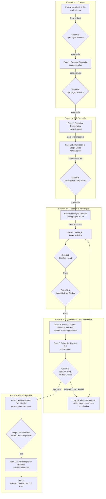

# Documentação Técnica: Arquitetura do Sistema tolkien

O **Academic Article Production Multi-Agent System (tolkien)** é um harness multi-agente de padrão industrial para apoiar o ciclo completo de produção de artigos acadêmicos e científicos. O sistema opera de forma estritamente sequencial, auditável e orientada a arquivos, guiado pela metodologia **Academic Spec-Driven Development (SDD)**.

> **Idioma / Language:** Português | [English Version](../../technical/architecture.md)

---

## 1. Contexto e Objetivos

### 1.1 Problema Resolvido
A redação científica assistida por modelos de linguagem enfrenta quatro falhas crônicas na prática de pesquisa:
1. **Alucinação e Descompasso Numérico:** O texto da prosa frequentemente contradiz tabelas, figuras ou estatísticas descritivas do próprio estudo.
2. **Citações Fantasmas ou Órfãs:** Chaves citadas no texto não existem no arquivo bibliográfico (`.bib`) ou referências listadas na bibliografia não são referenciadas no manuscrito.
3. **Vícios Estilísticos e Superficialidade ("Tom de IA"):** Argumentos genéricos, uso excessivo de adjetivos vagos, falta de mecanismo causal e ausência de enquadramento disciplinar específico.
4. **Falta de Rastreabilidade e Governança:** Pipelines em caixa-preta onde o pesquisador não tem controle sobre os pontos de decisão, escolhas teóricas e critérios metodológicos.

### 1.2 Objetivos de Engenharia
- **Execução Sequencial Determinística:** O manuscrito avança por 10 fases formais (0 a 9) com 7 gates de bloqueio mandatórios.
- **Persistência Exclusiva no Sistema de Arquivos:** Todo o estado do artigo vive em arquivos Markdown, BibTeX e JSON sob o diretório do projeto (`papers/{slug}/`), garantindo idempotência e retomabilidade sem banco de dados em memória.
- **Verificação Multidimensional:** Integração de analisadores determinísticos (Python/regex/parsers) com avaliação por pares simulada em 6 dimensões.
- **Interoperabilidade Multi-IDE:** Suporte nativo com arquitetura *canonical-first* para **OpenAI Codex**, **OpenCode**, **Google Antigravity** e espelhamento para **Claude Code CLI**.

---

## 2. Fronteiras e Limites do Sistema

| No Escopo do Sistema (In-Scope) | Fora do Escopo do Sistema (Out-of-Scope) |
|---|---|
| • Entrevista socrática de requisitos e geração de PRD acadêmico (`prd.md`). | • Submissão automatizada de manuscritos para portais de periódicos ou conferências. |
| • Elaboração de plano detalhado de execução (`plan.md`). | • Gerenciamento direto de bibliotecas no Zotero ou Mendeley via API síncrona. |
| • Busca sistemática e triagem bibliográfica via OpenAlex API. | • Interface gráfica web (GUI) independente (opera exclusivamente via harness de agentes/CLI). |
| • Redação modular por seções com Fichas de Escopo (*Scope Cards*) e padrão CEI (*Claim-Evidence-Interpretation*). | • Execução ou retreinamento de modelos estatísticos primários que geraram os dados brutos. |
| • Auditoria determinística de citações vs bibliografia (Gate G4). | • Gestão simultânea de múltiplos artigos em um único subdiretório de projeto. |
| • Validação determinística de congruência texto-dados (Gate G4.5). | |
| • Auditoria estática de qualidade de prosa (`academic-writing-reviewer`). | |
| • Revisão por pares simulada em 6 dimensões com Advogado do Diabo (Gate G5). | |
| • Loop de Revisão Contínua (Fases 5–7) com auto-correção. | |
| • Validação e compilação de formatos de saída (Markdown, LaTeX/PDF e Word DOCX). | |

---

## 3. Componentes Principais e Responsabilidades

O sistema é modularizado em três camadas funcionais rigorosamente desacopladas:

```
┌─────────────────────────────────────────────────────────────────────────────┐
│                    ARQUITETURA DE 3 CAMADAS DO TOLKIEN                      │
├─────────────────────────────────────────────────────────────────────────────┤
│  CAMADA L1: 8 AGENTES COORDENADORES                                         │
│  Orquestração de alto nível, gestão de gates e interface com usuário        │
├─────────────────────────────────────────────────────────────────────────────┤
│  CAMADA L2: 12 SKILLS DE PIPELINE ACADÊMICO                                 │
│  Lógica de domínio científico, metodologias de escrita e análise textual    │
├─────────────────────────────────────────────────────────────────────────────┤
│  CAMADA L3: 12 SKILLS DE FERRAMENTA & INFRAESTRUTURA                        │
│  Manipulação de formatos (TeX, DOCX, XLSX, PDF), busca e automação web      │
└─────────────────────────────────────────────────────────────────────────────┘
```

### 3.1 Camada L1 — Os 8 Agentes Coordenadores

| Agente | Arquivo de Definição | Responsabilidade Central | Skills Principais Acionadas |
|---|---|---|---|
| **`academic-orchestrator`** | `.agents/agents/academic-orchestrator.md` | Coordenador Mestre. Executa o pipeline de 10 fases, gerencia os checkpoints humanos e orquestra o Loop de Revisão Contínua. | Todas as skills e subagentes |
| **`research-agent`** | `.agents/agents/research-agent.md` | Especialista em levantamento de literatura, buscas booleanas na OpenAlex, triagem de relevância e enriquecimento de `.bib`. | `academic-researcher`, `academic-bibliography-manager`, skills de busca |
| **`writing-agent`** | `.agents/agents/writing-agent.md` | Redação integral de seções baseada em Scope Cards e padrão CEI, elaboração de mídia visual e execução de reescritas corretivas. | `academic-writer`, `academic-media`, `academic-humanizer` |
| **`review-agent`** | `.agents/agents/review-agent.md` | Execução do painel de revisão por pares simulado em 6 dimensões (EiC, 3 revisores e Advogado do Diabo) e validação de citação. | `academic-reviewer`, `academic-citation-manager`, `academic-writing-reviewer` |
| **`data-validation-agent`** | `.agents/agents/data-validation-agent.md` | Auditoria determinística de congruência numérica entre o corpo do texto e tabelas/figuras/datasets; opera o Gate G4.5. | `academic-data-validator` |
| **`format-validation-agent`** | `.agents/agents/format-validation-agent.md` | Validação contínua e não-bypasável de integridade de formato em Markdown, LaTeX e Word (.docx); opera o Output Format Gate. | `academic-format-validator`, `docx`, `latex` |
| **`paper-generator-agent`** | `.agents/agents/paper-generator-agent.md` | Montagem e compilação dos manuscritos finais para PDF (via LaTeX) e DOCX estilizado para periódicos. | `latex`, `latex-template-converter`, `pdf`, `docx` |
| **`web-browser-search-agent`** | `.agents/agents/web-browser-search-agent.md` | Busca web para literatura cinzenta, recuperação de texto integral, resolução de DOIs e checagem de retratações. | `web-browser-search`, `duckducksearch`, `agent-browser`, `playwright-cli` |

### 3.2 Camada L2 — As 12 Skills de Pipeline Acadêmico

| Skill | Localização | Entrada Principal | Saída Produzida |
|---|---|---|---|
| **`academic-prd`** | `.agents/skills/academic-prd/` | Entrevista socrática de configuração | `prd.md` validado (Gate G1) |
| **`academic-plan`** | `.agents/skills/academic-plan/` | `prd.md` aprovado | `plan.md` com fases e tarefas (Gate G2) |
| **`academic-researcher`** | `.agents/skills/academic-researcher/` | Questões de pesquisa e strings de busca | `research/literature_review.md`, `research/search_strategy.md` |
| **`academic-bibliography-manager`** | `.agents/skills/academic-bibliography-manager/` | DOIs, títulos e entradas brutas | `research/references.bib` enriquecido e deduplicado |
| **`academic-writer`** | `.agents/skills/academic-writer/` | `prd.md`, `plan.md`, referências e dados | Rascunhos modulares em `draft/*.md` (Gate G3) |
| **`academic-citation-manager`** | `.agents/skills/academic-citation-manager/` | `draft/*.md` e `references.bib` | `review/citation-audit-report.md` (Gate G4) |
| **`academic-data-validator`** | `.agents/skills/academic-data-validator/` | `draft/*.md`, tabelas e dados brutos | `review/data-congruence-report.md` (Gate G4.5) |
| **`academic-format-validator`** | `.agents/skills/academic-format-validator/` | Documentos `.md`, `.tex` e `.docx` | `review/format-validation-report.md` (Output Format Gate) |
| **`academic-writing-reviewer`** | `.agents/skills/academic-writing-reviewer/` | Rascunhos em `draft/*.md` | `review/writing-review-report.md` (Score Dimensão 5) |
| **`academic-reviewer`** | `.agents/skills/academic-reviewer/` | Rascunhos completos e relatórios de suporte | `review/peer-review-report.md` (Gate G5) |
| **`academic-humanizer`** | `.agents/skills/academic-humanizer/` | Rascunhos recém-redigidos | Texto com cadência natural e sem vícios de IA |
| **`academic-media`** | `.agents/skills/academic-media/` | Dados tabulares ou especificações de figura | Diagramas conceituais, gráficos e `draft/08-figure-legends.md` |

### 3.3 Camada L3 — As 12 Skills de Ferramenta e Infraestrutura

- **Manipulação de Documentos:** `docx` (leitura, escrita e XML de Word), `latex` (compilação e tratamento de erros TeX), `latex-template-converter` (adaptação IEEE/ACM/Springer/NeurIPS), `pdf` (inspeção, extração, OCR e split), `xlsx` (análise de planilhas e recálculo).
- **Busca e Web:** `web-search`, `duckducksearch`, `web-browser-search`, `agent-browser`, `playwright-cli`.
- **Governança Multi-IDE:** `multi-ide-artifacts` (sincronização cross-IDE), `creating-skills` (geração e validação de novas skills).

---

## 4. Fluxo de Dados e Transições de Estado (Ponta a Ponta)

O avanço da produção ocorre através de uma esteira rigorosa em que nenhum estado posterior é acessado sem aprovação do gate correspondente:



### 4.1 Os 7 Gates de Qualidade do Sistema

1. **Gate G1 (Aprovação do PRD):** Confirmação humana obrigatória de `prd.md`. Impede que o artigo comece sem delimitação teórica e de escopo.
2. **Gate G2 (Aprovação do Plano):** Confirmação humana de `plan.md`. Garante alinhamento nas fases, entregáveis parciais e prazos.
3. **Gate G3 (Aprovação de Estrutura & Scope Cards):** Confirmação humana da tese central e das fichas de escopo de cada seção.
4. **Gate G4 (Gate de Citação ↔ Bibliografia):** Script determinístico (`citation_gate.py`). Bloqueia o pipeline se houver citações órfãs no texto ou chaves sem referência no `.bib`.
5. **Gate G4.5 (Gate de Integridade de Dados):** Script determinístico (`data_congruence_gate.py` e `check_float_integrity.py`). Valida se todo número citado na prosa corresponde aos dados de tabelas/figuras, se cálculos percentuais fecham 100% e se as chamadas de tabelas/figuras são bidirecionais.
6. **Gate G5 (Gate de Revisão por Pares):** Avaliação em 6 dimensões (`peer-review-report.md`). Exige nota média ponderada $\ge 7.0/10$, zero itens críticos do Advogado do Diabo em aberto e todos os itens de Prioridade 1 resolvidos.
7. **Output Format Gate:** Verificação estrutural e sintática não-bypasável (`validate_formats.py`) sobre arquivos `.md`, `.tex` (compilação limpa) e `.docx` (integridade XML e estilo).

### 4.2 Mecânica do Loop de Revisão Contínua (Fases 5–7)
Quando o `review-agent` identifica itens de Prioridade 1 ou o Gate G4.5 aponta descompasso numérico:
1. O veredito do relatório é gravado como `REVISE_AND_RESUBMIT`.
2. O `academic-orchestrator` compila a matriz de pendências e aciona o `writing-agent`.
3. O `writing-agent` realiza intervenções cirúrgicas nas seções rascunhadas sem reescrever o texto inteiro.
4. A esteira retorna imediatamente para a Fase 5 para checagem determinística (G4 e G4.5).
5. O ciclo se repete até a **Aprovação Completa** (`ACCEPT`). Se 3 loops consecutivos não convergirem, o orquestrador interrompe a execução e invoca um checkpoint humano.

---

## 5. Pontos de Integração e Ecossistema Multi-IDE

### 5.1 APIs e Ferramentas Externas
- **OpenAlex API:** Busca semântica e booleana em mais de 250 milhões de trabalhos acadêmicos; resolução reversa de DOIs e metadados bibliográficos completos.
- **Crossref & Unpaywall:** Resolução de links abertos e metadados de publicação para enriquecimento de referências.
- **Latexmk / PDFLaTeX / XeLaTeX:** Compiladores de documentos científicos com renderização de fórmulas, tabelas com `tabularray` e árvores de bibliografia com BibTeX/Biber.
- **Python-docx & Lxml:** Motor de montagem de documentos Microsoft Word com aplicação de estilos tipográficos e rotinas de anonimização *double-blind*.

### 5.2 Estrutura Canônica Multi-IDE

O sistema aplica a estratégia **Canonical-First**:

```text
tolkien/
├── .agents/                    ← Raiz Canônica (Codex, OpenCode, Antigravity)
│   ├── agents/                 ← Agentes canônicos (.md)
│   └── skills/                 ← Skills atômicas (SKILL.md, scripts/, references/)
├── .claude/                    ← Espelho Dedicado para Claude Code CLI
│   ├── agents/                 ← Subagentes espelhados
│   ├── skills/                 ← Skills espelhadas
│   └── settings.json           ← Hooks de ciclo de vida (format-validator)
├── .codex/                     ← Harness OpenAI Codex
│   ├── agents/*.toml           ← Descritores TOML
│   └── hooks.json              ← Hooks de execução determinística
├── .opencode/                  ← Harness OpenCode
│   ├── agents/*.md             ← Descritores de agente
│   └── plugins/*.js            ← Plugin de validação contínua
├── AGENTS.md                   ← Regras globais de engenharia (Codex/Antigravity)
└── CLAUDE.md                   ← Instruções globais de engenharia (Claude Code)
```

---

## 6. Restrições, Invariantes e Decisões de Projeto

### 6.1 Invariantes Fundamentais do Sistema
1. **Invariante da Verdade dos Dados (Data Primacy):** Em nenhuma circunstância o texto pode fabricar ou arredondar arbitrariamente métricas que contrariem a tabela original.
2. **Invariante da Citação Ancorada:** Nenhuma afirmação pertencente aos 6 Gatilhos de Motivação pode ser enunciada sem uma citação bibliográfica explícita ou evidência primária.
3. **Invariante do Isolamento de Seções (Scope Discipline):** Cada seção deve responder estritamente à sua Scope Card; discussões teóricas não podem invadir resultados, e a metodologia não antecipa conclusões.
4. **Invariante de Formato:** Nenhum artefato final é entregue sem passar pelo `Output Format Gate`.

### 6.2 Registros de Decisões de Arquitetura (ADRs)

- **ADR 01: Canonical-First em `.agents/`**
  - *Decisão:* Armazenar o código e as especificações centrais sob `.agents/` e espelhar automaticamente para `.claude/`, `.codex/` e `.opencode/`.
  - *Justificativa:* Evita deriva de versões (*drift*) entre diferentes ferramentas de agentes IA e assegura que uma única correção de script beneficie todos os ambientes.
- **ADR 02: Padrão CEI e Scope Cards**
  - *Decisão:* Proibir redação livre sem antes formalizar a `Scope Card` da seção e a estrutura CEI (*Claim $\rightarrow$ Evidence $\rightarrow$ Interpretation*) nos parágrafos.
  - *Justificativa:* Erradica a dispersão temática e garante que o texto atenda aos critérios de densidade e causalidade de bancas acadêmicas rigorosas.
- **ADR 03: Separação entre Validação Determinística e Avaliação por LLM**
  - *Decisão:* Isolar verificações binárias (contagem de citações, checagem de números, integridade de tags XML/LaTeX) em scripts Python puros, reservando os LLMs para a avaliação semântica e argumentativa.
  - *Justificativa:* Modelos de linguagem são falíveis em tarefas aritméticas e de contagem estrita. Scripts Python oferecem garantia matemática de 100% de precisão nos gates.
- **ADR 04: Loop de Revisão Fechado até Aprovação Completa**
  - *Decisão:* A etapa de revisão e reescrita é recursiva e mandatória, impedindo que o manuscrito seja exportado com pendências de Prioridade 1 em aberto.
  - *Justificativa:* Garante que o manuscrito entregue ao pesquisador já tenha passado por uma bateria exaustiva de refinamento, minimizando o retrabalho na submissão real.
