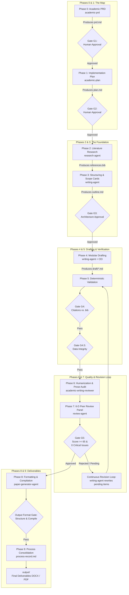

# Technical Documentation: tolkien System Architecture

The **Academic Article Production Multi-Agent System (tolkien)** is an industrial-grade multi-agent harness designed to support the complete lifecycle of academic and scientific papers. The system operates strictly sequentially, auditably, and file-centrically, guided by the **Academic Spec-Driven Development (SDD)** methodology.

> **Language / Idioma:** English | [Versão em Português](../pt-BR/tecnica/arquitetura.md)

---

## 1. Context and Goals

### 1.1 Problems Solved
Scientific writing assisted by large language models suffers from four chronic failure modes:
1. **Hallucination and Numeric Discrepancies:** Prose frequently contradicts tables, figures, or descriptive statistics from the study itself.
2. **Phantom and Orphan Citations:** In-text citation keys missing in `.bib`, or bibliography entries never referenced in the draft.
3. **Stylistic Clichés and AI Monotony:** Generic assertions, excessive adjectives, lack of causal mechanisms, and absent domain-specific framing.
4. **Lack of Traceability and Governance:** Black-box pipelines where the researcher lacks control over critical decision points, theoretical framing, and methodological trade-offs.

### 1.2 Engineering Objectives
- **Deterministic Sequential Execution:** The manuscript progresses through 10 formal phases (0 to 9) with 7 mandatory quality gates.
- **Exclusive File-System Persistence:** All paper state resides in Markdown, BibTeX, and JSON files under `papers/{slug}/`, ensuring idempotence and resumeability without in-memory databases.
- **Multidimensional Verification:** Integration of deterministic scripts (Python/regex/parsers) with simulated 6-dimension peer review panels.
- **Multi-IDE Interoperability:** Native *canonical-first* support for **Google Antigravity**, **OpenAI Codex**, **OpenCode**, and mirrored support for **Claude Code CLI**.

---

## 2. System Boundaries and Scope

| In-Scope | Out-of-Scope |
|---|---|
| • Socratic requirements interview and academic PRD generation (`prd.md`). | • Automated manuscript submission to publisher portals or conference submission systems. |
| • Detailed execution plan generation (`plan.md`). | • Synchronous two-way live sync with Zotero/Mendeley cloud libraries. |
| • Systematic literature search and triage via OpenAlex API. | • Standalone external web GUI (operates exclusively via agent harnesses/CLI). |
| • Modular section drafting with Scope Cards and CEI (*Claim-Evidence-Interpretation*) architecture. | • Primary statistical model training/execution that produces raw empirical datasets. |
| • Deterministic citation ↔ bibliography validation (Gate G4). | • Concurrent multi-paper editing in a single project subfolder. |
| • Deterministic text-data congruence validation (Gate G4.5). | |
| • Static writing quality and prose audit (`academic-writing-reviewer`). | |
| • Simulated 6-D peer review panel with Devil's Advocate (Gate G5). | |
| • Continuous Revision Loop (Phases 5–7) with automated rewriting. | |
| • Multi-format output validation and compilation (Markdown, LaTeX/PDF, Word DOCX). | |

---

## 3. Main Components and Responsibilities

The system is modularized into three strictly decoupled functional layers:

```
┌─────────────────────────────────────────────────────────────────────────────┐
│                    TOLKIEN THREE-LAYER ARCHITECTURE                         │
├─────────────────────────────────────────────────────────────────────────────┤
│  LAYER L1: 8 COORDINATOR AGENTS                                             │
│  High-level orchestration, gate enforcement, and user interaction           │
├─────────────────────────────────────────────────────────────────────────────┤
│  LAYER L2: 12 ACADEMIC PIPELINE SKILLS                                      │
│  Scientific domain logic, drafting methodology, and text analysis           │
├─────────────────────────────────────────────────────────────────────────────┤
│  LAYER L3: 12 TOOL & INFRASTRUCTURE SKILLS                                  │
│  Document format manipulation (TeX, DOCX, XLSX, PDF), web search & browser  │
└─────────────────────────────────────────────────────────────────────────────┘
```

### 3.1 Layer L1 — The 8 Coordinator Agents

| Agent | Definition File | Core Responsibility | Primary Skills Dispatched |
|---|---|---|---|
| **`academic-orchestrator`** | `.agents/agents/academic-orchestrator.md` | Master Coordinator. Executes the 10-phase pipeline, manages human checkpoints, and drives the Continuous Revision Loop. | All skills and subagents |
| **`research-agent`** | `.agents/agents/research-agent.md` | Literature search, OpenAlex queries, source triage, and `.bib` enrichment. | `academic-researcher`, `academic-bibliography-manager`, search skills |
| **`writing-agent`** | `.agents/agents/writing-agent.md` | Full-text drafting based on Scope Cards and CEI patterns, scientific media generation, and corrective rewriting. | `academic-writer`, `academic-media`, `academic-humanizer` |
| **`review-agent`** | `.agents/agents/review-agent.md` | Simulated 6-dimension peer review panel (EiC, 3 reviewers, Devil's Advocate) and citation validation. | `academic-reviewer`, `academic-citation-manager`, `academic-writing-reviewer` |
| **`data-validation-agent`** | `.agents/agents/data-validation-agent.md` | Deterministic numeric congruence between text and tables/figures/datasets; runs Gate G4.5. | `academic-data-validator` |
| **`format-validation-agent`** | `.agents/agents/format-validation-agent.md` | Always-on format validation across Markdown, LaTeX, and Word (.docx); runs Output Format Gate. | `academic-format-validator`, `docx`, `latex` |
| **`paper-generator-agent`** | `.agents/agents/paper-generator-agent.md` | Assembly and compilation of final manuscripts to PDF (via LaTeX) and styled journal DOCX. | `latex`, `latex-template-converter`, `pdf`, `docx` |
| **`web-browser-search-agent`** | `.agents/agents/web-browser-search-agent.md` | Web search for grey literature, full-text retrieval, DOI resolution, and retraction checks. | `web-browser-search`, `duckducksearch`, `agent-browser`, `playwright-cli` |

### 3.2 Layer L2 — The 12 Academic Pipeline Skills

| Skill | Location | Primary Input | Produced Output |
|---|---|---|---|
| **`academic-prd`** | `.agents/skills/academic-prd/` | Socratic setup interview | Validated `prd.md` (Gate G1) |
| **`academic-plan`** | `.agents/skills/academic-plan/` | Approved `prd.md` | `plan.md` with phases and tasks (Gate G2) |
| **`academic-researcher`** | `.agents/skills/academic-researcher/` | Research questions and search strings | `research/literature.md`, `research/search-strategy.md` |
| **`academic-bibliography-manager`** | `.agents/skills/academic-bibliography-manager/` | DOIs, titles, and raw bib entries | Enriched and deduplicated `research/references.bib` |
| **`academic-writer`** | `.agents/skills/academic-writer/` | `prd.md`, `plan.md`, references, and data | Modular drafts in `draft/*.md` (Gate G3) |
| **`academic-citation-manager`** | `.agents/skills/academic-citation-manager/` | `draft/*.md` and `references.bib` | `review/citation-report.md` (Gate G4) |
| **`academic-data-validator`** | `.agents/skills/academic-data-validator/` | `draft/*.md`, tables, figures | `review/data-congruence-report.md` (Gate G4.5) |
| **`academic-format-validator`** | `.agents/skills/academic-format-validator/` | `.md`, `.tex`, and `.docx` files | `review/format-validation-report.md` (Output Format Gate) |
| **`academic-writing-reviewer`** | `.agents/skills/academic-writing-reviewer/` | Draft sections in `draft/*.md` | `review/writing-review-report.md` (Feeds Dimension 5) |
| **`academic-reviewer`** | `.agents/skills/academic-reviewer/` | Complete drafts and audit reports | `review/review-report.md` (Gate G5) |
| **`academic-humanizer`** | `.agents/skills/academic-humanizer/` | Draft sections | Naturalized text without AI markers |
| **`academic-media`** | `.agents/skills/academic-media/` | Tabular data or figure specs | Figures, diagrams, and `draft/08-figure-legends.md` |

### 3.3 Layer L3 — The 12 Tool and Infrastructure Skills

- **Document Processing:** `docx` (Word manipulation and XML validation), `latex` (TeX compilation and error recovery), `latex-template-converter` (IEEE/ACM/Springer/NeurIPS adaptation), `pdf` (inspection, extraction, OCR, split/merge), `xlsx` (spreadsheet analysis and arithmetic recalculation).
- **Web & Browser Automation:** `web-search`, `duckducksearch`, `web-browser-search`, `agent-browser`, `playwright-cli`.
- **Meta-Tooling:** `multi-ide-artifacts` (cross-IDE synchronization), `creating-skills` (skill creation and validation).

---

## 4. End-to-End Data Flow and State Transitions

Manuscript progression follows a strict pipeline where no subsequent state is accessed without approval of the corresponding gate:



### 4.1 The 7 System Quality Gates

1. **Gate G1 (PRD Approval):** Mandatory human approval of `prd.md`. Prevents research work without clear theoretical and scope boundaries.
2. **Gate G2 (Plan Approval):** Mandatory human approval of `plan.md`. Ensures alignment across phases, deliverables, and timelines.
3. **Gate G3 (Outline & Scope Cards Approval):** Human confirmation of section thesis and Scope Cards.
4. **Gate G4 (Citation ↔ Bibliography Gate):** Deterministic script (`citation_gate.py`). Blocks pipeline if orphan in-text citations or uncited `.bib` entries exist.
5. **Gate G4.5 (Data Integrity Gate):** Deterministic scripts (`data_congruence_gate.py` and `check_float_integrity.py`). Validates that every number cited in prose corresponds to tables/figures, percentages add to 100%, and table/figure calls are bidirectional.
6. **Gate G5 (6-D Peer Review Gate):** Evaluation across 6 dimensions (`review-report.md`). Requires weighted composite score $\ge 65/100$, 0 unresolved Devil's Advocate CRITICAL items, and all Priority-1 items addressed.
7. **Output Format Gate:** Always-on structural and syntax validation (`validate_formats.py`) for Markdown, LaTeX (clean compilation), and Word (.docx) deliverables.

### 4.2 Mechanics of the Continuous Revision Loop (Phases 5–7)
When the `review-agent` identifies Priority-1 items or Gate G4.5 flags data discrepancies:
1. The verdict is logged as `REVISE_AND_RESUBMIT`.
2. The `academic-orchestrator` compiles the revision roadmap and activates `writing-agent`.
3. The `writing-agent` performs surgical revisions on drafted sections without rewriting entire unproblematic chapters.
4. The pipeline returns immediately to Phase 5 for deterministic checking (G4 and G4.5).
5. The loop repeats until **Complete Approval** (`ACCEPT`). If 3 consecutive loops fail to converge, the orchestrator halts and requests human intervention.

---

## 5. Multi-IDE Ecosystem and Integration Points

### 5.1 Canonical Multi-IDE Structure

The system enforces a **Canonical-First** architecture:

```text
tolkien/
├── .agents/                    ← Canonical Root (Antigravity, Codex, OpenCode)
│   ├── agents/                 ← Canonical agent descriptors (.md)
│   └── skills/                 ← Atomic Agent Skills (SKILL.md, scripts/, references/)
├── .claude/                    ← Dedicated Mirror for Claude Code CLI
│   ├── agents/                 ← Mirrored subagents (.md)
│   ├── skills/                 ← Mirrored skills
│   └── settings.json           ← Lifecycle hooks
├── .codex/                     ← OpenAI Codex Harness
│   ├── agents/*.toml           ← TOML descriptors
│   └── hooks.json              ← Deterministic lifecycle hooks
├── .opencode/                  ← OpenCode Harness
│   ├── agents/*.md             ← Agent descriptors
│   └── plugins/*.js            ← Format validator plugin
├── AGENTS.md                   ← Canonical engineering rules (Antigravity/Codex)
└── CLAUDE.md                   ← Root instructions for Claude Code
```

---

## 6. System Invariants and Architecture Decision Records (ADRs)

### 6.1 Fundamental System Invariants
1. **Data Primacy Invariant:** Under no circumstances may text fabricate or arbitrarily round numbers contradicting the primary data tables.
2. **Anchored Citation Invariant:** No assertion within the 6 Motivation Triggers may be stated without an explicit citation or primary evidence.
3. **Scope Discipline Invariant:** Each section must strictly answer to its Scope Card; theoretical debates may not invade results, and methodology may not anticipate conclusions.
4. **Format Invariant:** No deliverable is delivered without passing the `Output Format Gate`.

### 6.2 Architecture Decision Records (ADRs)

- **ADR 01: Canonical-First in `.agents/`**
  - *Decision:* Store core code and specifications in `.agents/` and mirror automatically to `.claude/`, `.codex/`, and `.opencode/`.
  - *Rationale:* Eliminates drift between AI tools and ensures a single bugfix benefits all environments simultaneously.
- **ADR 02: CEI Pattern and Scope Cards**
  - *Decision:* Prohibit unconstrained free writing without pre-defined Scope Cards and CEI structure (*Claim $\rightarrow$ Evidence $\rightarrow$ Interpretation*).
  - *Rationale:* Eliminates thematic rambling and ensures rigorous academic density and causal motivation.
- **ADR 03: Separation of Deterministic Validation and LLM Review**
  - *Decision:* Isolate binary checks (citation counts, numeric verification, float integrity, XML/LaTeX syntax) in pure Python scripts, reserving LLMs for semantic and argumentation critique.
  - *Rationale:* Language models are unreliable at arithmetic and strict counting. Python scripts guarantee 100% mathematical precision.
- **ADR 04: Closed Revision Loop Until Complete Approval**
  - *Decision:* The review and rewriting step is recursive and mandatory, blocking final deliverable export while Priority-1 findings remain open.
  - *Rationale:* Guarantees that deliverables delivered to researchers have completed rigorous automated polish, minimizing real-world peer-review friction.
